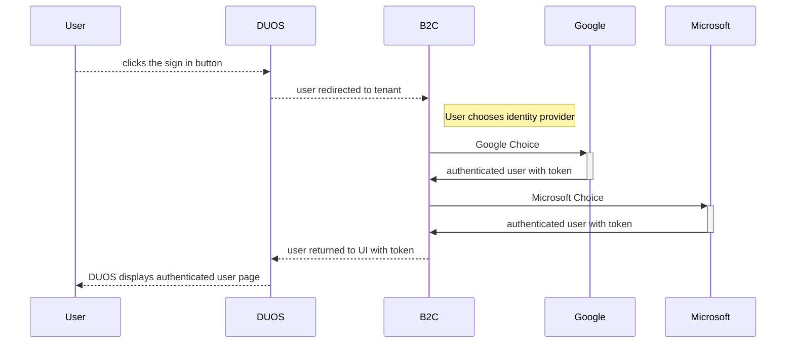
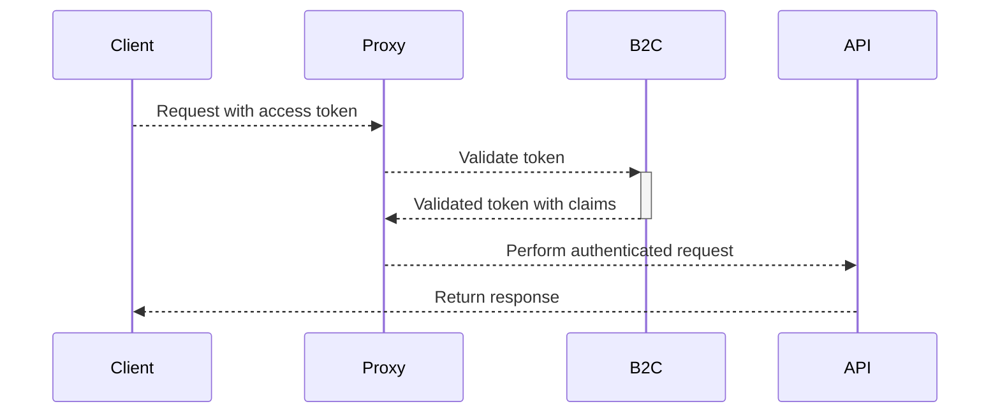

## DUOS B2C Authentication Overview

DUOS' implementation of B2C authentication follows a similar pattern that
Terra has adopted. In short, we use OIDC libraries to direct a user to a
DSP-specific B2C tenant. That tenant offers up two ways of providing an
identity, Google or Microsoft. Choosing one directs the user to either a
Google or Microsoft authentication verification screen. Once authenticated,
the user is redirected back to the application with a valid token that can
be used for all back-end API calls.

## Table of Contents
* UI Auth Flow
* DSP's B2C Tenant Choices
* Server Auth Flow

### UI Auth Flow

* User: Any Google or Microsoft identity such as a real person, or a service account of some kind
* DUOS: The DUOS Application
* B2C: The DSP proxy that proxies authentication through either Google or Microsoft
* Google: If a user chooses Google, a Google identity is expected
* Microsoft: If a user chooses Microsoft, a Microsoft identity is expected

### OIDC Mechanics

DUOS uses the [oidc-client-ts](https://github.com/authts/oidc-client-ts) library
to facilitate user authentication through either Google or Microsoft. Once authenticated,
the library returns to DUOS with user claims information about the authenticated identity.
DSP's tenant requests claims that are [configured here](https://github.com/broadinstitute/terraform-ap-deployments/blob/master/azure/b2c/policies/SignUpOrSignin.xml.tftpl).
Once authenticated, the DUOS application will use the `oidc-client-ts` library to access
an identity's `access_token` and make API calls using it. All downstream API servers are
expected to validate that token against the same B2C tenant. 

### DSP's B2C Tenant Choices

### Server Auth Flow

Back-end servers are each configured with a proxy that can verify a token
from any of the identity providers configured in our B2C tenant. The proxy
tacks on a list of extra headers that services can use:
* OAUTH2_CLAIM_email
* OAUTH2_CLAIM_name
* OAUTH2_CLAIM_access_token
* OAUTH2_CLAIM_aud

