## DUOS B2C Authentication Overview

DUOS' implementation of B2C authentication follows a similar pattern that
Terra has adopted. In short, we use OIDC libraries to direct a user to a
DSP-specific B2C tenant. That tenant offers up two ways of providing an
identity, Google or Microsoft. Choosing one directs the user to either a
Google or Microsoft authentication verification screen. Once authenticated,
the user is redirected back to the application with a valid token that can
be used for all back-end API calls.

## Table of Contents
* [UI Auth Flow](#UI-Auth-Flow)
* [OIDC Mechanics](#OIDC-Mechanics)
* [DSP's B2C Tenant Choices](#DSP's-B2C-Tenant-Choices)
* [Server Auth Flow](#Server-Auth-Flow)

### UI Auth Flow

* User: Any Google or Microsoft identity such as a real person, or a service account of some kind
* DUOS: The DUOS Application
* B2C: The DSP proxy that proxies authentication through either Google or Microsoft
* Google: If a user chooses Google, a Google identity is expected
* Microsoft: If a user chooses Microsoft, a Microsoft identity is expected

### OIDC Mechanics

DUOS uses the [oidc-client-ts](https://github.com/authts/oidc-client-ts) library
to facilitate user authentication through either Google or Microsoft. Once authenticated,
the library provides DUOS with user information about the authenticated identity and an 
access token that can be verified/validated in a proxy layer that sits in front of each
service DUOS communicates with.

DSP's tenant requests claims that are [configured here](https://github.com/broadinstitute/terraform-ap-deployments/blob/master/azure/b2c/policies/SignUpOrSignin.xml.tftpl).
Once authenticated, the DUOS application will use the `oidc-client-ts` library to access
an identity's `access_token` and make API calls using it. All downstream API servers are
expected to validate that token against the same B2C tenant.

DUOS' implementation instantiates an OIDC library [UserManager](https://authts.github.io/oidc-client-ts/classes/UserManager.html)
that handles most of our authentication logic. `UserManager` is instantiated with configuration values
that come from open (and intentionally undocumented) server side APIs:
* Authorization Endpoint: https://consent.dsde-prod.broadinstitute.org/oauth2/authorize
* Token Endpoint: https://consent.dsde-prod.broadinstitute.org/oauth2/token

These endpoints return configuration information specific to DSP's custom tenant. From there, 
we use `OidcBroker` functions to instantiate a [User](https://authts.github.io/oidc-client-ts/classes/User.html),
which we extend as a `OidcUser` and tack on a set of `B2cIdTokenClaims` that extends [IdTokenClaims](https://authts.github.io/oidc-client-ts/interfaces/IdTokenClaims.html).

#### Sign In Case

#### Sign Out Case

### DSP's B2C Tenant

DSP maintains resources in Azure that allow for a customized tenant in
https://github.com/broadinstitute/terraform-ap-deployments/tree/master/azure/b2c

* In `assets`, there is a unified_simple.html file that serves as a template for a sign-in page
* In `policies`, there is a `TrustFrameworkBase.xml.tftpl` that references that template 
* In `policies`, there is a `TrustFrameworkBaseExtension.xml.tftpl` that references that TrustFrameworkBase
* In `policies`, there is a `SignUpOrSignin.xml.tftpl` that references that TrustFrameworkExtension

For DUOS, we have custom versions of each that have new profile name, `B2C_1A_signup_signin_duos_<env>`.
The profile name is used as a parameter to the OIDC tenant. The UI the tenant shows is based on
that profile name.

### Server Auth Flow

Back-end servers are each configured with a proxy that can verify a token
from any of the identity providers configured in our B2C tenant. The proxy
tacks on a list of extra headers that services can use:
* OAUTH2_CLAIM_email
* OAUTH2_CLAIM_name
* OAUTH2_CLAIM_access_token
* OAUTH2_CLAIM_aud

```mermaid
%%{init: { 'theme': 'forest' } }%%
sequenceDiagram
    Client -->> Proxy: Request with access token
    Proxy -->>+ B2C Tenant: Validate token
    B2C Tenant -->>- Proxy: Validated token with claims
    Proxy -->> API: Perform authenticated request
    API -->> Client: Return response
```

