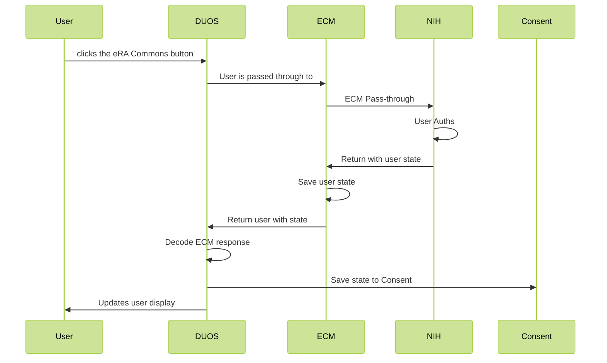

# eRA Commons Integration

DUOS uses ECM as an intermediary to allow users to authenticate
with NIH. ECM provides a redirect url that we point the user to.
Once authenticated, the user is redirected back to ECM which saves
the authentication information and then redirects the user back to 
the originating URL. DUOS, historically, also saved this information
locally in Consent. This allows Data Access Committees the ability to
see if a researcher is an NIH user. 

