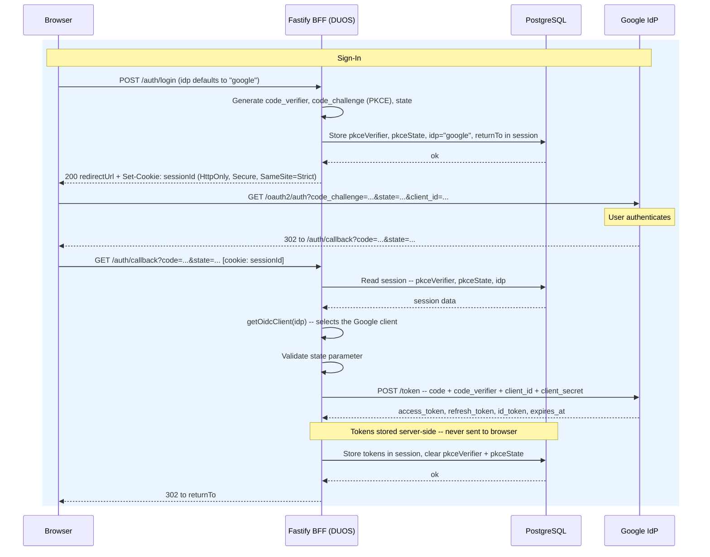
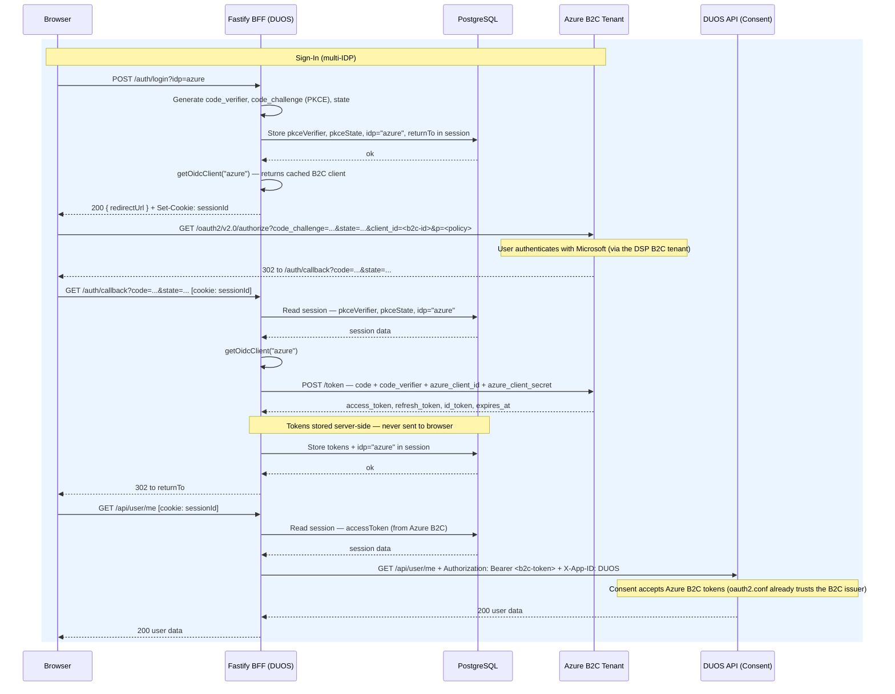
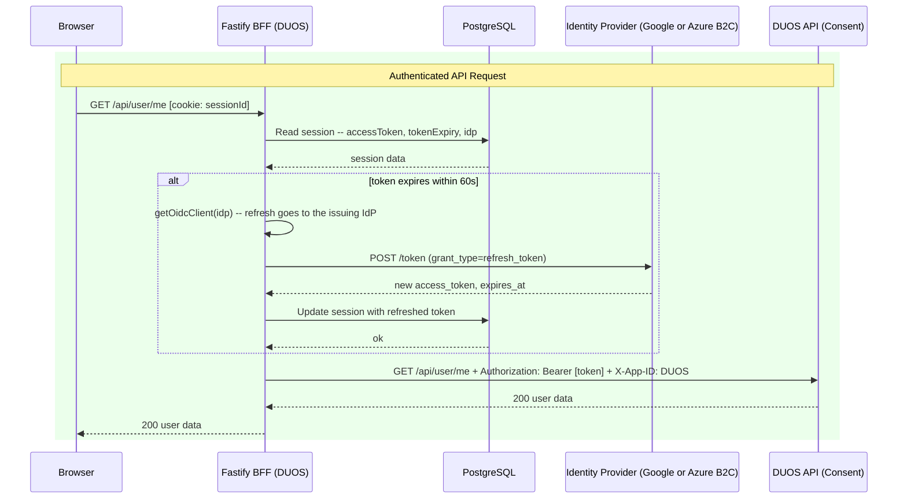
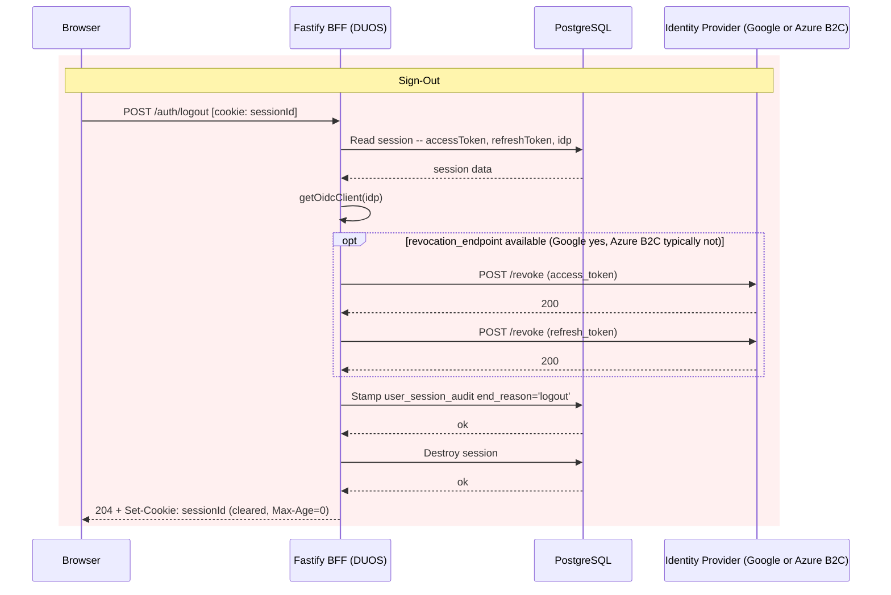

# Backend For Frontend (BFF) Migration — Overview

DUOS-UI is migrating its authentication architecture from browser-managed OAuth
tokens to the **Backend For Frontend (BFF)** pattern recommended by
[IETF BCP 212](https://datatracker.ietf.org/doc/bcp212/) (*OAuth 2.0 for Browser-Based Apps*).

## Why

Today the client stores OAuth credentials (access, ID, refresh, and IDP access
tokens) in browser `localStorage`. Any cross-site scripting (XSS) vulnerability
on the origin — in first- or third-party code — could exfiltrate all of them in
a single call, and there is no server-side session to revoke a stolen token.
Because DUOS gates access to controlled-access genomic datasets, this risk
warrants a stronger architecture.

## Target architecture

After the migration the browser holds **zero tokens**:

- The existing Fastify server becomes a BFF that owns the full OAuth 2.0
  authorization-code + PKCE flow against the identity provider.
- Tokens live only in a server-side session backed by PostgreSQL. The browser
  receives a single opaque session cookie (`HttpOnly`, `SameSite=Strict`,
  `Secure`) that JavaScript cannot read.
- All API calls are proxied through the BFF, which attaches the
  `Authorization: Bearer` header server-side and transparently refreshes
  expiring tokens.
- Logout destroys the server session and revokes tokens at the identity
  provider where supported — closing the "stolen token stays valid" gap.

The BFF supports two identity providers — **Google** and **Microsoft (Azure
B2C)** — behind a single session architecture and a single callback route.
Provider configuration is issuer-URL-driven, so future provider changes are
configuration, not code.

## Implementation phases

Parent Jira: [DT-3604](https://broadworkbench.atlassian.net/browse/DT-3604)

The work is split into seven phases, delivered in order.

| Phase | Name | Summary | Jira | Status |
|---|---|---|---|---|
| 0 | Environment Configuration | Provision OAuth clients/app registrations for each identity provider and deliver server-side credentials and configuration (client secrets, session secret, database and issuer config) to the deployment environments. | [DT-3605](https://broadworkbench.atlassian.net/browse/DT-3605) | ✅ |
| 1 | Server Foundation & Session Infrastructure | Add session middleware to the Fastify server with a PostgreSQL-backed session store, automated expired-session cleanup, and a metadata-only session audit trail. No user-visible changes. | [DT-3606](https://broadworkbench.atlassian.net/browse/DT-3606) | ✅ |
| 2 | Server-Side OAuth Flow | Implement the BFF auth routes (`/auth/login`, `/auth/callback`, `/auth/logout`, `/auth/me`) using `openid-client`, with PKCE and per-provider client selection. Runs alongside the legacy client-side flow during rollout. | [DT-3607](https://broadworkbench.atlassian.net/browse/DT-3607) | |
| 3 | API Proxy Layer | Add a reverse proxy so the client calls relative `/api/*` URLs; the server injects the Bearer token from the session and proactively refreshes tokens before expiry. | [DT-3608](https://broadworkbench.atlassian.net/browse/DT-3608) | |
| 4 | Client Refactor | Remove all token handling from the React client: drop `oidc-client-ts` and localStorage token storage, switch the fetch layer to relative URLs, and replace the popup sign-in with a full-page redirect with provider selection. | [DT-3609](https://broadworkbench.atlassian.net/browse/DT-3609) | |
| 5 | Security Hardening | Layer additional defenses: strict Content Security Policy, CSRF protection, session-fixation protection (session ID regeneration), token revocation on logout, SRI/third-party script audit, and rate limiting on auth endpoints. | [DT-3610](https://broadworkbench.atlassian.net/browse/DT-3610) | |
| 6 | Testing, Observability & Rollout | E2E test coverage, auth/session metrics and alerting, and a config-driven (`bffEnabled` in `config.json`) per-environment cutover. The legacy flow is removed only after the new flow is stable in production. | [DT-3611](https://broadworkbench.atlassian.net/browse/DT-3611) | |

## Rollout strategy

Two independent switches control the rollout. Both are deployment
configuration, resolved from local files/env at pod startup — no network
dependency at boot, and every pod of a given deployment behaves identically.

- **Session infrastructure: database env config.** The server registers its
  Postgres/cookie/session plugins when the deployment provides the database
  configuration (`DUOS_DB_HOST` etc., via helmfile env vars). The
  infrastructure is inert until users are routed to it — sessions are only
  created by the BFF auth routes.
- **Auth-flow cutover: `bffEnabled` in `config.json`.** Each environment's
  `config.json` (the same deploy-time file that carries `apiUrl` etc.)
  declares a boolean `bffEnabled`. The server checks it at startup and only
  then enables the BFF auth routes and directs users down the BFF sign-in
  flow; the client reads the same `config.json` it already fetches, so both
  sides agree by construction. A missing key defaults to `false` — the
  fail-safe is the legacy client-side flow.

Cutover proceeds environment by environment (dev → staging → prod) by setting
`bffEnabled: true` in that environment's `config.json` and restarting pods —
a config change and pod restart, not a live flag flip. That trade is
deliberate: no runtime dependency on a feature-flag service, no mixed-mode
pods, and deterministic behavior — everyone in an environment sees the same
flow, so each rollout stage is directly testable. Rollback is the same
operation in reverse. The two switches are independent: an environment can
have the session infrastructure configured (and exercised by tests) while
`bffEnabled` is still `false`.

Google and Azure B2C are supported behind the same flag, so we can test both
in each environment before cutting over.

> Status: as of Phase 1 nothing reads `bffEnabled` yet — the flag-gated
> routing lands with the Phase 2 auth routes.

## Key architectural decisions

- **PostgreSQL-backed sessions** — reuses existing infrastructure, survives
  restarts, supports horizontal scaling, and allows server-side revocation
  (stateless encrypted cookies cannot).
- **Full-page redirect instead of popup** — required by the BFF callback model,
  and eliminates the COOP (`Cross-Origin-Opener-Policy`) breakage that affects
  popup-based flows.
- **Single `/auth/callback` route for all providers** — the session records
  which provider initiated the flow, keeping redirect-URI registration and
  configuration simple.
- **`openid-client` for all OAuth/OIDC operations** — library-maintained PKCE,
  token exchange, and ID-token validation (signature, `iss`, `aud`, `exp`,
  `nonce`) rather than hand-rolled crypto.

## Target Architecture Sequence Diagrams

Four flows are shown: sign-in (including PKCE and token exchange), the multi-IDP
sign-in variant, an authenticated API request (including proactive token refresh),
and sign-out (including server-side session destruction and IdP token revocation).
Tokens appear only on the server side of the dashed boundary. All four flows are
IDP-parameterized via the session's `idp` field — the BFF selects the matching OIDC
client with `getOidcClient(idp)` at every step that contacts an IdP. The Azure B2C
variant is shown separately only where the sign-in flow differs.

### Authentication Flow (Google)

### Authentication Flow — Multi-IDP Variant (Azure B2C)

The sign-in flow with IDP selection. The authenticated API call and sign-out flows are identical to the Google flows — `getOidcClient(idp)` simply resolves to the B2C client. The trailing API request is included here only to illustrate that Consent accepts B2C-issued tokens with no proxy changes.

### Authenticated API Call Flow

### Sign-out Flow

