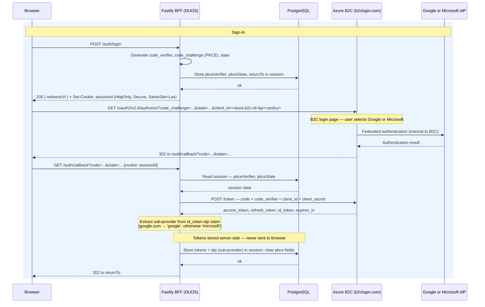
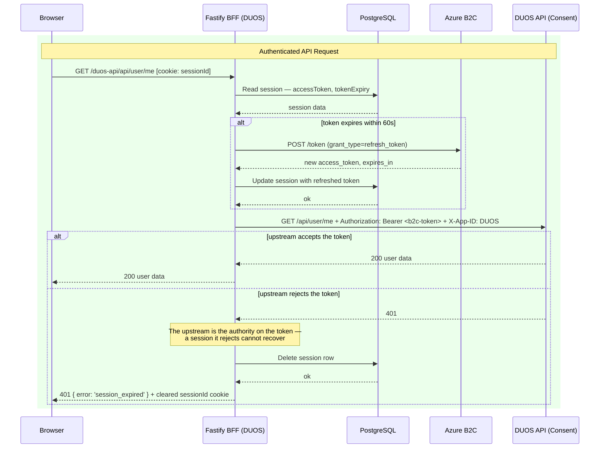
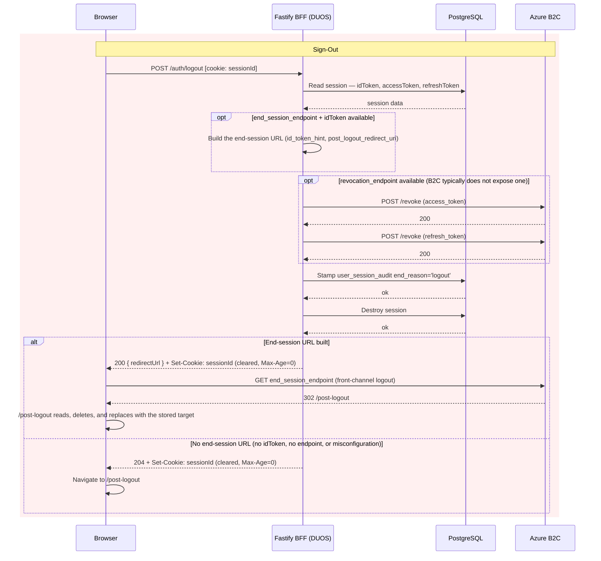

# Backend For Frontend (BFF) Migration — Overview

DUOS-UI is migrating its authentication architecture from browser-managed OAuth
tokens to the **Backend For Frontend (BFF)** pattern recommended by
[IETF BCP 212](https://datatracker.ietf.org/doc/bcp212/) (*OAuth 2.0 for Browser-Based Apps*).

## Why

Today the client stores OAuth credentials (access, ID, refresh, and IDP access
tokens) in browser `localStorage`. Any cross-site scripting (XSS) vulnerability
on the origin — in first- or third-party code — could exfiltrate all of them in
a single call, and there is no server-side session to revoke a stolen token.
Because DUOS gates access to controlled-access genomic datasets, this risk
warrants a stronger architecture.

## Target architecture

After the migration the browser holds **zero tokens**:

- The existing Fastify server becomes a BFF that owns the full OAuth 2.0
  authorization-code + PKCE flow against the identity provider.
- Tokens live only in a server-side session backed by PostgreSQL. The browser
  receives a single opaque session cookie (`HttpOnly`, `SameSite=Lax`,
  `Secure`) that JavaScript cannot read. Lax rather than Strict because the
  OAuth callback arrives as a top-level redirect from B2C — Strict cookies are
  withheld from cross-site-initiated navigations, which would strand the PKCE
  state; CSRF tokens land with the endpoints they protect (Phases 2–4) and
  Phase 5 verifies the coverage.
- All API calls are proxied through the BFF, which attaches the
  `Authorization: Bearer` header server-side and transparently refreshes
  expiring tokens.
- Logout destroys the server session and revokes tokens at the identity
  provider where supported — closing the "stolen token stays valid" gap.

The BFF holds **one OIDC client — Azure B2C**. The browser is redirected to the
existing B2C login page, which presents the Google and Microsoft sign-in options
exactly as it does today; B2C federates to the chosen provider internally and
issues the tokens the BFF stores. The session records which **sub-provider** the
user chose (`'google' | 'microsoft'`), extracted from the B2C `id_token`'s `idp`
claim at callback — this drives the audit trail and observability metrics, not
client selection. Because the B2C client is configured entirely through
`DUOS_AZURE_ISSUER_URL` / `DUOS_AZURE_CLIENT_ID` / `DUOS_AZURE_CLIENT_SECRET`,
a future migration (e.g., B2C → Entra External ID) is a config swap, not code.

## Implementation phases

Parent Jira: [DT-3604](https://broadworkbench.atlassian.net/browse/DT-3604)

The work is split into seven phases, delivered in order.

| Phase | Name | Summary | Jira | Status |
|---|---|---|---|---|
| 0 | Environment Configuration | Provision OAuth clients/app registrations for each identity provider and deliver server-side credentials and configuration (client secrets, session secret, database and issuer config) to the deployment environments. | [DT-3605](https://broadworkbench.atlassian.net/browse/DT-3605) | ✅ |
| 1 | Server Foundation & Session Infrastructure | Add session middleware to the Fastify server with a PostgreSQL-backed session store, automated expired-session cleanup, and a metadata-only session audit trail. No user-visible changes. | [DT-3606](https://broadworkbench.atlassian.net/browse/DT-3606) | ✅ |
| 2 | Server-Side OAuth Flow | Implement the BFF auth routes (`/auth/login`, `/auth/callback`, `/auth/logout`, `/auth/me`) using `openid-client` against the single Azure B2C client, with PKCE; the callback extracts the sub-provider from the B2C `id_token`. Runs alongside the legacy client-side flow during rollout. | [DT-3607](https://broadworkbench.atlassian.net/browse/DT-3607) | ✅ |
| 3 | API Proxy Layer | Add a reverse proxy so the client calls relative `/duos-api/*` URLs; the server injects the Bearer token from the session and proactively refreshes tokens before expiry. | [DT-3608](https://broadworkbench.atlassian.net/browse/DT-3608) | ✅ |
| 4 | Client Refactor | Move all token handling out of the BFF-mode React client: switch the fetch layer to relative URLs and replace the popup sign-in with a full-page redirect to the B2C login page (which presents the Google/Microsoft choice, unchanged). The legacy `oidc-client-ts` flow (tokens in localStorage) remains behind `bffEnabled` until Phase 6 removes it. | [DT-3609](https://broadworkbench.atlassian.net/browse/DT-3609) | ✅ |
| 5 | Security Hardening | Layer additional defenses: strict Content Security Policy, end-to-end verification of CSRF coverage (enforcement lands with the endpoints in Phases 2–4) plus Fetch Metadata enforcement, session-fixation protection (session ID regeneration), cookie-attribute hardening, B2C front-channel logout, replacement of the runtime-loaded Google Charts script, and rate limiting on auth endpoints. | [DT-3610](https://broadworkbench.atlassian.net/browse/DT-3610) |        |
| 6 | Testing, Observability & Rollout | E2E test coverage, auth/session metrics and alerting, and a config-driven (`bffEnabled` in `config.json`) per-environment cutover. The legacy flow is removed only after the new flow is stable in production. | [DT-3611](https://broadworkbench.atlassian.net/browse/DT-3611) |        |

## Rollout strategy

Two independent switches control the rollout. Both are deployment
configuration, resolved from local files/env at pod startup — no network
dependency at boot, and every pod of a given deployment behaves identically.

- **Session infrastructure: database env config.** The server registers its
  Postgres/cookie/session plugins when the deployment provides the database
  configuration (`DUOS_DB_HOST` etc., via helmfile env vars). The
  infrastructure is inert until users are routed to it — sessions are only
  created by the BFF auth routes.
- **Auth-flow cutover: `bffEnabled` in `config.json`.** Each environment's
  `config.json` (the same deploy-time file that carries `apiUrl` etc.)
  declares a boolean `bffEnabled`. The server checks it at startup and only
  then enables the BFF auth routes and directs users down the BFF sign-in
  flow; the client reads the same `config.json` it already fetches, so both
  sides agree by construction. A missing key defaults to `false` — the
  fail-safe is the legacy client-side flow.

Cutover proceeds environment by environment (dev → staging → prod) by setting
`bffEnabled: true` in that environment's `config.json` and restarting pods —
a config change and pod restart, not a live flag flip. That trade is
deliberate: no runtime dependency on a feature-flag service, no mixed-mode
pods, and deterministic behavior — everyone in an environment sees the same
flow, so each rollout stage is directly testable. Rollback is the same
operation in reverse. The two switches are independent: an environment can
have the session infrastructure configured (and exercised by tests) while
`bffEnabled` is still `false`.

Both sub-providers (Google-federated and Microsoft) flow through the same B2C
client behind the same flag, so we can test both sign-in paths in each
environment before cutting over.

> Status: the flag-gated routing is live. The server gates the BFF auth
> routes and proxies on `bffEnabled` at startup (Phase 2/3), and the Phase 4
> client directs sign-in through the BFF flow when it is true. Per-environment
> cutover is Phase 6 work.

## Architecture decision records

One sequence, numbered continuously. ADR-001 through ADR-008 were settled with
the migration plan and are summarised below; the ones that needed fuller
treatment — because they were resolved during implementation, with alternatives
and residual risk worth recording — have their own files under
[`bff_adrs/`](bff_adrs/). That is why the directory holds 004 and 009 through
012 rather than 001 through 003: the numbers belong to this list, not to the
directory.

| ADR | Decision | Phase |
|---|---|---|
| [001](#adr-001--postgresql-backed-sessions-via-fastifysession) | PostgreSQL-backed sessions via `@fastify/session` | 1 |
| [002](#adr-002--full-page-redirect-for-oauth-instead-of-popup) | Full-page redirect for OAuth instead of popup | 2, 4 |
| [003](#adr-003--remove-oidc-client-ts-entirely-in-phase-6) | Remove `oidc-client-ts` entirely | 4, 6 |
| [004](#adr-004--fastifyreply-from-on-a-duos-api-prefix-for-the-proxy) | `@fastify/reply-from` on a `/duos-api` prefix for the proxy | 3 |
| [005](#adr-005--single-authcallback-route) | Single `/auth/callback` route | 2 |
| [006](#adr-006--lazy-oidc-client-initialization-with-startup-warm-up) | Lazy OIDC client init with startup warm-up | 2 |
| [007](#adr-007--idp-stored-in-session-as-sub-provider) | `idp` stored as sub-provider, from the B2C `id_token` claim | 2 |
| [008](#adr-008--azure-b2c-as-single-oidc-entry-point) | Azure B2C as the single OIDC entry point | 0, 2 |
| [009](#adr-009--state-changing-upstream-gets-are-proxied-not-blocked) | State-changing upstream GETs are proxied, not blocked | 3, 5 |
| [010](#adr-010--the-proxy-scope-declares-its-own-error-shape) | The proxy scope declares its own error shape | 3, 4 |
| [011](#adr-011--one-identity-per-browser-cross-tab-account-switching-reloads-the-stale-tab) | One identity per browser: cross-tab account switching reloads the stale tab | 4 |
| [012](#adr-012--session-cookie-is-samesitelax-with-csrf-tokens-closing-the-gap) | Session cookie is `SameSite=Lax`, with CSRF tokens closing the gap | 1, 2–4 |

### ADR-001 — PostgreSQL-backed sessions via `@fastify/session`

Sessions must survive restarts and work across horizontally scaled pods, which
rules out an in-memory store. PostgreSQL is already DUOS infrastructure, so the
BFF uses `@fastify/postgres` for pool management with a thin
`createPgSessionStore`, and app-level TLS (`ssl: { rejectUnauthorized: true }`)
unless the transport is already loopback. `@fastify/secure-session` (stateless
encrypted cookies) was rejected: it cannot invalidate a session server-side,
which is exactly what logout has to do.

### ADR-002 — Full-page redirect for OAuth instead of popup

The existing `oidc-client-ts` popup is incompatible with a server-side callback
handler, and it also breaks in practice: the IdP response sets
`Cross-Origin-Opener-Policy: same-origin`, which severs the `window.opener`
reference the library needs to deliver the token back to the parent, so sign-in
fails silently. The popup existed to avoid losing client-side state across a
navigation, but the session cookie survives the redirect naturally and a
`returnTo` field in the session restores the user's destination. A full-page
redirect is unaffected by COOP headers on the IdP's domain.

### ADR-003 — Remove `oidc-client-ts` entirely in Phase 6

The library's event system is only used for client-side token expiry, which
server-side proactive refresh (60 s before expiry, in the proxy) makes
unnecessary. It will be removed rather than left in place: keeping it invites
reuse of its `WebStorageStateStore`, which would re-introduce the vulnerability
this migration exists to close. Phase 4 stopped the BFF-mode client from using
it; the legacy flow still uses it behind `bffEnabled`, so the removal itself is
Phase 6 work, after the BFF flow is stable in production.

### ADR-004 — `@fastify/reply-from` on a `/duos-api` prefix for the proxy

**Full record:** [bff_adrs/ADR-004-api-proxy-layer.md](bff_adrs/ADR-004-api-proxy-layer.md)
— resolved in story 3-A, with the alternatives and sub-decisions.

`@fastify/reply-from` inside a route the BFF declares itself, rather than
`@fastify/http-proxy` or a hand-rolled `fetch` proxy. It streams multipart
uploads and document downloads instead of buffering them, and declaring the route
keeps the auth gate, the single-flight refresh, and upstream-401 handling as
ordinary route hooks. One `/duos-api` prefix maps to the upstream root, because 9
of the client's paths are not under `/api`; bodies pass through unparsed, so CSRF
must read its token from a header.

### ADR-005 — Single `/auth/callback` route

With one OIDC client there is nothing to disambiguate at the callback, so there
is one route and one `DUOS_OAUTH_REDIRECT_URI` — no per-provider routing and no
additional redirect URIs to register.

### ADR-006 — Lazy OIDC client initialization with startup warm-up

`discovery()` costs an HTTP round-trip to B2C's `.well-known` document, which
would land on the first user's sign-in. The client is warmed at startup and
cached, but a failed warm-up is logged and non-fatal, with lazy initialization as
the fallback — so first-login latency is paid once without making B2C
availability a hard startup dependency.

### ADR-007 — `idp` stored in session as sub-provider

With a single B2C client, the session's `idp` field does not record which OIDC
client was used; it records which provider the user picked on the B2C login page,
derived from the `id_token`'s `idp` claim at callback (`google.com` → `'google'`,
otherwise `'microsoft'`). It feeds the audit trail, observability, and
`/auth/me` — not client selection, and not refresh, which B2C handles uniformly.
Parsing the access token's `iss` on every request was rejected: it adds CPU cost
per request and assumes the B2C access token stays a parseable JWT, which is not
guaranteed.

### ADR-008 — Azure B2C as single OIDC entry point

v1 proposed two OIDC clients (Google and B2C) with an `idp` parameter on
`/auth/login`, which required a multi-client factory, provider-selection UI in
DUOS, and per-provider integration tests. v2 lets B2C's existing login page make
that choice instead: one client, one scope string, no branching, and the sign-in
UX users see today is unchanged. Consent already accepts B2C tokens for
Microsoft users, so extending that to Google-federated users is a known-working
path, and the B2C policy already federates both providers — no policy change.

**Trade-off accepted:** Google-federated users get B2C-issued rather than
Google-issued tokens. The raw Google `idp_access_token` that `oidc-client-ts`
stores today is not forwarded to Consent under either approach, since the proxy
always forwards the primary `access_token`. A later move to Entra External ID
changes `DUOS_AZURE_ISSUER_URL` and its siblings, not the BFF's structure.

### ADR-009 — State-changing upstream GETs are proxied, not blocked

**Full record:** [bff_adrs/ADR-009-state-changing-gets.md](bff_adrs/ADR-009-state-changing-gets.md)
— the audit behind it, both endpoints, and the residual-risk analysis.

`SameSite=Lax` is required by the OAuth callback redirect and a CSRF token cannot
guard a GET, which leaves two upstream endpoints that mutate state on GET
forgeable by a plain link. Blocking either breaks the app — one is how the client
learns who the user is — so the residual risk was accepted and documented, and the
real fix (making the side effect a POST) belongs upstream in Consent (DT-3945).

Phase 5 (story 5-B) then closed the residual for modern browsers with Fetch
Metadata enforcement: a positive allowlist requiring `Sec-Fetch-Site:
same-origin` plus a `cors`/`same-origin` mode, applied to every proxy prefix
and to `/auth/me` (`server/src/security/fetchMetadata.ts`). Requests without
the headers — older browsers and non-browser clients — are allowed and remain
covered only by the original accepted-risk analysis.

### ADR-010 — The proxy scope declares its own error shape

**Full record:** [bff_adrs/ADR-010-proxy-error-shape.md](bff_adrs/ADR-010-proxy-error-shape.md)
— the experiment behind it, the alternatives, and what the client keys on.

The proxy is an encapsulated plugin, so it captured Fastify's default error
handler and never inherits the app's sanitizing one. Rather than reorder the
registrations, the proxy declares its own: CSRF rejections return
`{ error: 'csrf_validation_failed', reason }` and everything else returns the
same generic body as the rest of the app. The client needs that one code because
403 is otherwise ambiguous through the proxy — an upstream authorization denial
arrives as a 403 too, as an ordinary proxied response — so Phase 4 keys its single
refetch-and-retry on the body, not the status.

### ADR-011 — One identity per browser: cross-tab account switching reloads the stale tab

**Full record:** [bff_adrs/ADR-011-single-identity-per-browser.md](bff_adrs/ADR-011-single-identity-per-browser.md)
— the interleavings behind it, the join rule, and the accepted risks.

With the BFF, every tab shares one session cookie, so "two users in two tabs"
is not a state the system can be in — only a stale tab displaying a previous
user. The client's session reconciler (`useSessionReconciler`) resolves a
detected identity conflict the way mainstream multi-account applications do:
a conflict with no bootstrap in flight re-bootstraps in place, and a conflict
under an in-flight bootstrap cancels it and hard-reloads the tab. The reload
discards transient tab state — an accepted cost that removed the supersede
and provenance machinery a graceful in-place merge kept demanding.

### ADR-012 — Session cookie is `SameSite=Lax`, with CSRF tokens closing the gap

**Full record:** [bff_adrs/ADR-012-session-cookie-samesite.md](bff_adrs/ADR-012-session-cookie-samesite.md)
— the threat model, the alternatives, and the `response_mode=query` assumption.
**Infosec answer:** [infosec-session-cookie-samesite.md](infosec-session-cookie-samesite.md).

`Strict` is unusable, not merely stricter: B2C's `302` back to `/auth/callback`
is a cross-site top-level GET, so a `Strict` cookie is withheld, the callback
arrives sessionless, and every login fails. `Lax` blocks cross-site POSTs and
credentialed fetches but treats sibling `*.broadinstitute.org` subdomains as
same-site, so it is not sufficient alone — session-bound CSRF tokens, which do
not depend on the registrable domain, are what cover unsafe routes, and the PKCE
`state` binding is what neutralizes login CSRF on the deliberately exempt
`/auth/login`.

The `Lax` rescue depends on B2C returning via GET (`response_mode=query`, the
code-flow default); `form_post` would break login exactly as `Strict` does. A
`Strict` session cookie paired with a short-lived `Lax` OAuth-transaction cookie
was considered and rejected — it does not close the sibling-subdomain gap, which
is same-site either way. `__Host-` prefixing is recorded as complementary later
hardening (it blocks cookie tossing, not CSRF) and needs `Secure` unconditionally,
including in CI.

The options are defined once in `server/src/session/sessionOptions.ts` and
imported by the server and all five test harnesses, so changing `sameSite` or
`rolling` fails the suite.

### Decisions not tracked as ADRs

- **`openid-client` (v6) for all OAuth/OIDC operations** — library-maintained
  PKCE, token exchange, and ID-token validation (signature, `iss`, `aud`,
  `exp`) rather than hand-rolled crypto.

## Target Architecture Sequence Diagrams

Three flows are shown: sign-in (including B2C provider selection, PKCE, and
token exchange), an authenticated API request (including proactive token
refresh), and sign-out (including server-side session destruction). Tokens
appear only on the server side of the dashed boundary. B2C handles both Google
and Microsoft authentication internally — the BFF is unaware of which provider
the user chose until the sub-provider is extracted from the B2C `id_token` at
callback.

### Authentication Flow

### Authenticated API Call Flow

Consent's `oauth2.conf` already trusts the B2C issuer (it accepts B2C tokens
for all Microsoft users today), so B2C-issued tokens are forwarded for both
sub-providers with no proxy changes.

### Sign-out Flow

Destroying the BFF session is only half of a sign-out: the browser also holds
Azure B2C's own single sign-on cookie. `POST /auth/logout` therefore returns the
B2C end-session URL and the client navigates to it (front-channel logout, Phase
5). Because the client calls the endpoint with `fetch`, the server cannot
redirect the browser itself, so the response mirrors `/auth/login`'s
`{ redirectUrl }` shape.

Only two answers confirm anything, and the client treats every other response —
a malformed body, a 200 without a `redirectUrl`, a 403, a 500, a transport
failure — as an **unconfirmed** sign-out. An unconfirmed sign-out performs no
local cleanup and claims no success: the client probes `GET /auth/me` instead,
and a 401 there proves the session is gone. When even that is unknowable, the
user sees a persistent notice with a Retry.

| Response | Meaning | Client action |
| --- | --- | --- |
| `200 { redirectUrl }` | The session is destroyed and B2C exposes an end-session endpoint | Local cleanup, then navigate to B2C |
| `204` | The session is destroyed; no single sign-out could be arranged | Local cleanup, then navigate to `/post-logout` |
| anything else | Unknown | Verify with `GET /auth/me`, then retry or report |

B2C requires `post_logout_redirect_uri` to match a registered URI exactly, so
the local destination cannot ride in it. `/post-logout` is the one registered
URI (env var `DUOS_POST_LOGOUT_REDIRECT_URI`); the client stores its
destination in `sessionStorage` before the logout, and `/post-logout` reads it,
deletes it, validates it again, and replaces the history entry with it.

Automatic sign-out on a terminal upstream 401 is local-only by design. The
proxy destroys the session before the 401 reaches the browser, so the
`id_token_hint` is already gone and no B2C leg is possible. `prompt: 'login'`
on every authorization request remains the guarantee that the B2C login screen
always appears.

