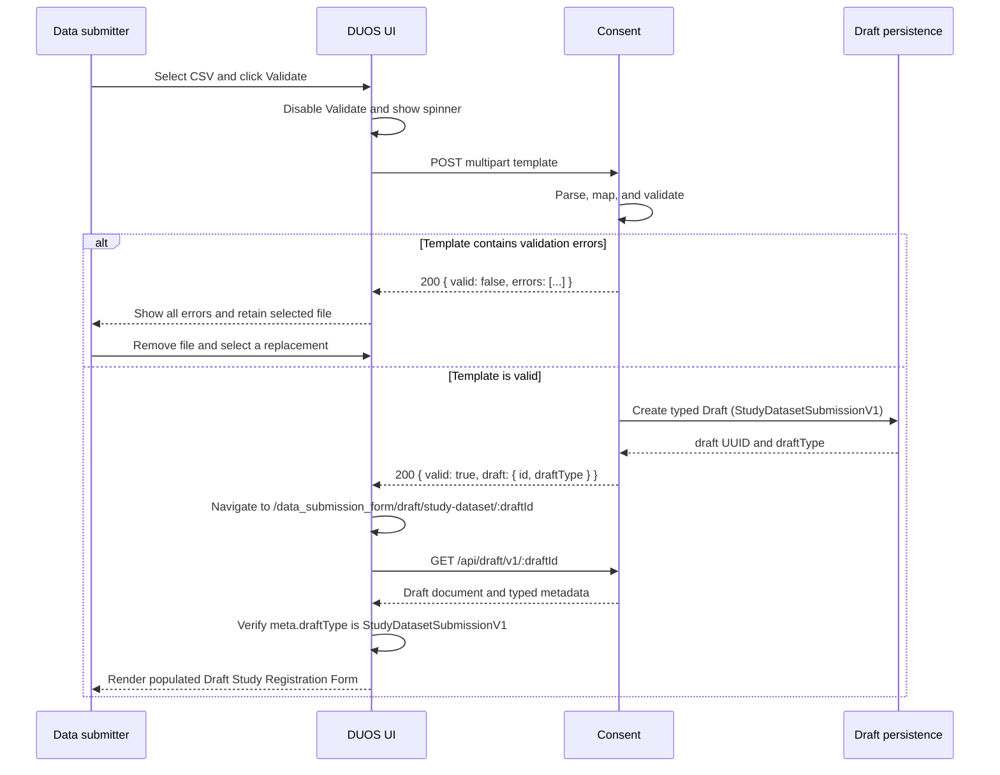

# Study Template Validation Workflow

## Summary

Add a validation workflow for completed study/dataset CSV templates. A user uploads a template,
validates it without submitting a study, corrects any reported errors in the source file, and
uploads a replacement. Successful validation persists a generic DUOS `Draft` whose `draftType` is
`StudyDatasetSubmissionV1`, then routes the user to a populated draft study registration form for
review. Consent represents that typed draft with `DraftStudyDataset`; the draft does not become a
submitted study or dataset until the user reviews and submits the form.

Jira: [DT-1855](https://broadworkbench.atlassian.net/browse/DT-1855)

## User story

As a user uploading a filled-out study/dataset template, I want to validate it before submission so that I can correct any errors without restarting the process.

## Requirements

- **WHEN** a user clicks **Validate**, **THE SYSTEM SHALL** show a loading spinner while processing the uploaded file.
- **WHEN** validation errors are found, **THE SYSTEM SHALL** display the errors and remain on the upload page.
- **WHEN** errors are shown, **THE SYSTEM SHALL** provide an option to remove the uploaded file and upload a new one.
- **WHEN** validation is successful, **THE SYSTEM SHALL** route the user to a DRAFT DUOS study page with form fields populated from the template.

## Current state

DUOS UI currently routes data submitters directly from **ADD DATASET** to the blank study registration form at `/data_submission_form`. `DataSubmissionFormV2` supports creating a study and editing a persisted study by numeric `studyId`, but it does not load draft registrations or accept template data.

Consent already provides generic draft persistence under `/api/draft/v1`. A draft UUID alone does
not identify what kind of document it contains; callers must also use the draft's `draftType`.
`DraftStudyDataset` is the `StudyDatasetSubmissionV1` implementation and stores a
registration-shaped JSON document under a UUID without validating its schema. The template
workflow should reuse the generic persistence and authorization mechanism while keeping CSV
validation and UI routing explicitly scoped to this draft type.
Consent's current registration authority is `StudyRegistrationRequest` plus
`StudyRegistrationRequestValidator`; `DatasetRegistrationSchemaV1` remains in reconstruction and
legacy compatibility paths but is not the validation model for new registration requests.

## Scope

This work includes:

- A CSV upload and validation page in DUOS UI.
- A Consent endpoint that parses and validates the template.
- Creation of a `Draft` with `draftType: StudyDatasetSubmissionV1` only after successful validation.
- A draft-specific study form route that loads and displays the populated draft.
- Unit, resource, integration, and UI tests for the new behavior.

This work does not include:

- Changing the existing manual study-registration workflow.
- Automatically submitting a valid template as a study.
- Client-side duplication of Consent business validation.
- Supporting arbitrary CSV layouts or template versions.

## Prerequisite: template specification

Implementation requires a versioned, canonical CSV fixture that defines:

- Required and optional headers.
- The mapping from each CSV field to the `StudyRegistrationRequest` wire contract.
- Encodings for arrays, booleans, dates, consent groups, and study assets.
- Whether unknown headers are ignored, warned about, or rejected.
- Maximum upload size and supported MIME types.
- How the template version is identified.

The parser and its tests should use the same committed fixtures. Template-format validation must happen before field-level business validation.

The v1 CSV will not carry uploaded files or filename-only placeholders. In particular,
`nihInstitutionalCertificationFileName` and `alternativeDataSharingPlanFileName` are excluded. The
populated draft form will show the corresponding upload controls empty so the user can attach files
before creating the study. Draft attachment upload is not part of this workflow.

## Proposed user flow



## API design

### Validate a template

Add an authenticated multipart endpoint to Consent:

```text
POST /api/draft/v1/study-dataset/template-validation
Content-Type: multipart/form-data
file: <CSV>
```

The typed path prevents this validator from becoming the implied validator for every future draft
type. The endpoint should allow `ADMIN`, `CHAIRPERSON`, and `DATASUBMITTER`, matching study
registration. Add `CHAIRPERSON` to the existing draft endpoints as well so all three roles can
create, resume, update, attach files to, and delete their authorized drafts. Existing ownership and
administrator authorization checks remain unchanged.

Validation errors are a completed, expected result and should return HTTP 200. Authentication, authorization, malformed multipart requests, size-limit violations, and unexpected server failures should use appropriate non-2xx responses.

Invalid template response:

```json
{
  "valid": false,
  "errors": [
    {
      "row": 3,
      "column": "piEmail",
      "message": "Must be a valid email address."
    }
  ]
}
```

Valid template response:

```json
{
  "valid": true,
  "draft": {
    "id": "c2e4583a-20b9-4705-8280-e6a5753f10c9",
    "draftType": "StudyDatasetSubmissionV1"
  },
  "errors": []
}
```

Proposed response models:

```ts
interface TemplateValidationError {
  row?: number
  column?: string
  message: string
}

interface StudyDatasetDraftReference {
  id: string
  draftType: 'StudyDatasetSubmissionV1'
}

type TemplateValidationResponse =
  | { valid: false, errors: TemplateValidationError[] }
  | { valid: true, errors: TemplateValidationError[], draft: StudyDatasetDraftReference }
```

Both branches use `TemplateValidationError[]` so callers can pass `errors` through uniformly. The
success branch is identified by `valid` and includes a typed draft reference.

The service should return every independently actionable validation error in one response. Parser
and type-conversion errors should include row and column when known. Violations returned by the
existing registration validator may be message-only because its current contract is `List<String>`;
the implementation must not infer a field by parsing human-readable messages. Messages must not
expose stack traces or raw exception details.

### Draft loading and submission

Use the existing endpoint to load the validated document:

```text
GET /api/draft/v1/{draftUUID}
```

Because this read endpoint is intentionally generic, duos-ui must verify that
`meta.draftType === 'StudyDatasetSubmissionV1'` before mapping the document into a study form. A
missing or different type is a recoverable load error and must not be submitted or deleted by the
study-registration workflow. Consent must add `draftType` to the generic draft-detail metadata and
OpenAPI `DraftDetails` schema; the current detail response does not expose it.

The draft should remain persisted if the user navigates away or if study creation fails. After the
user successfully creates the study, make one best-effort request to delete the source draft. Draft
deletion must occur only after study creation succeeds. If deletion fails, preserve the successful
study result, show a non-blocking cleanup notification, and emit error telemetry without uploaded
content. Do not promise an automatic retry in this ticket; the draft remains subject to the shared
draft retention policy.

## Consent implementation

Follow the existing Resource → Service → DAO layering:

1. Add the typed multipart endpoint under `/api/draft/v1/study-dataset/template-validation`, using
   a study/dataset-specific resource or typed subresource rather than a generic template validator.
2. Add a study/dataset template-validation service responsible for file checks, parsing, DTO
   mapping, and validation orchestration.
3. Map the parsed template into `StudyRegistrationRequest` and reuse `StudyRegistrationRequestValidator` so template and manual submissions cannot disagree.
4. Serialize the validated registration request into the registration-shaped draft document and construct `DraftStudyDataset` only when validation succeeds.
5. Persist the draft through `DraftService`.
6. Return both the UUID and `StudyDatasetSubmissionV1` draft type.
7. Add `draftType` to generic draft-detail metadata instead of relying on a UUID or the concrete
   server class to imply the document type.
8. Add `CHAIRPERSON` to the existing draft endpoint role annotations while preserving per-draft
   ownership checks.
9. Add the endpoint and updated draft-detail schemas to
   `src/main/resources/assets/api-docs.yaml`.

Parsing concerns must remain separate from business validation. Parser and conversion errors should
be normalized into `TemplateValidationError` entries with row and column information whenever
available. Existing DTO/domain violations may omit location; restructuring the shared validator to
return machine-readable field paths is a follow-up API improvement, not a requirement of this work.

## DUOS UI implementation

### Entry point and upload page

Add an **UPLOAD TEMPLATE** action next to the existing **ADD DATASET** action on My Data Submissions
for data submitters, chairpersons, and administrators. Preserve **ADD DATASET** as the entry point
for manual registration. Apply the same role set to the upload and typed draft-form routes.

Add a route such as:

```text
/data_submission_template
```

The upload page should contain:

- A CSV-only file input.
- The selected filename.
- A **Validate** button, disabled until a file is selected.
- The existing `AsyncSpinnerButton` loading treatment during validation.
- A **Remove** action whenever a file is selected.
- An inline error summary with every returned validation error.
- A link to continue with the blank manual form.

Page state should distinguish:

- The selected file.
- Validation errors returned by Consent.
- Request or server errors.
- The pending validation request.

Starting a new validation clears stale errors but retains the current file. Removing or replacing the file clears errors from the previous file.

### AJAX client

Add a typed multipart method to `src/libs/ajax/DataSet.ts` or a dedicated draft client. The method should return the discriminated validation response without converting field-validation errors into thrown exceptions.

### Draft form route

Add an explicit route so a draft UUID cannot be confused with an existing numeric study ID:

```text
/data_submission_form/draft/study-dataset/:draftId
```

Update `DataSubmissionFormV2` to support three explicit modes:

1. Blank study creation.
2. Existing study editing by `studyId`.
3. Draft study creation by `draftId`.

Draft mode should:

- Fetch the authorized draft by UUID.
- Verify `meta.draftType` is `StudyDatasetSubmissionV1` before reading the document.
- Convert the registration-shaped draft document into the UI `Study` model.
- Populate scalar fields, study properties, consent groups, and supported non-file assets.
- Leave file upload controls empty so the user can add required documents before submission.
- Use the title **Draft Study Registration Form**.
- Allow the user to review and edit all populated values.
- Submit through the existing study-creation path.
- Delete the draft only after successful creation.

Add the reverse mapping beside `studyToDatasetSchemaSubmission` in `v2-common-functions.tsx`.
Although the existing TypeScript wire interface retains the legacy name
`DatasetRegistrationSchemaV1`, it represents the request shape consumed by Consent rather than the
backend validation authority. Round-trip tests should demonstrate that supported draft fields
survive `draft document → Study → submission payload` conversion.

## Error handling and accessibility

- Keep the user on the upload page for validation and request errors.
- Display row and column context when provided; do not fabricate location for message-only business violations.
- Put validation results in an `aria-live` region.
- Set the Validate button's busy state during the request.
- Disable duplicate validation requests.
- Preserve the selected file after errors so the user can see which file was validated.
- Ensure the Remove action has an accessible name containing the filename.
- Treat network/server failures separately from CSV validation errors and allow retry.

## Test plan

### Consent

- Reject missing, empty, oversized, and unsupported uploads.
- Detect malformed CSV and incompatible template versions.
- Detect missing, duplicate, and unknown headers according to the template specification.
- Validate booleans, dates, emails, lists, enums, consent groups, and required values.
- Return multiple independent errors in one response.
- Include row and column information where possible.
- Create no draft for an invalid template.
- Create exactly one authorized draft for a valid template.
- Enforce `ADMIN`, `CHAIRPERSON`, and `DATASUBMITTER` roles while preserving owner-scoped draft
  authorization.
- Document and validate the endpoint in OpenAPI.

### DUOS UI

- Validate is disabled until a file is selected.
- The spinner and busy state appear while validation is pending.
- Returned errors render without navigation.
- Remove clears the file and its errors.
- A replacement file can be selected and validated.
- Request failures remain on the page and can be retried.
- Successful validation navigates using the returned typed draft reference.
- Draft loading populates representative scalar, property, consent-group, and non-file asset fields.
- File upload controls remain empty and usable after draft loading.
- A draft whose metadata is not `StudyDatasetSubmissionV1` is rejected before hydration.
- Missing or unauthorized drafts show a recoverable loading error.
- Successful study creation deletes the draft.
- Failed study creation retains the draft.
- Existing blank creation and persisted-study editing continue to work.

## Requirement traceability

| Requirement | Planned implementation |
|---|---|
| Show a spinner after Validate | Use `AsyncSpinnerButton`, disable duplicate requests, and expose the busy state. |
| Display errors and remain on upload page | Render the structured error response without navigating. |
| Allow removal and replacement | Show Remove for the selected file and reset file-specific validation state when used. |
| Route to a populated draft on success | Persist a `StudyDatasetSubmissionV1` draft, navigate to the typed draft route, verify its metadata, and hydrate the form from its document. |

## Decisions and options

The following choices should be confirmed before implementation. The recommended answers keep the
first release strict, versioned, and small enough to support without preventing future template
versions.

| Decision | Options | Recommended answer |
| --- | --- | --- |
| CSV layout | A. One wide row with numbered consent-group and asset columns.<br>B. Record-type rows, where each row identifies itself as study, consent group, or asset.<br>C. Multiple related CSV files delivered in a ZIP archive. | **B if no template has been distributed yet.** Record-type rows represent one-to-many data without numbered-column limits and still use one uploaded CSV. If users already have an approved template, preserve that layout as v1 instead of redesigning it in this ticket. |
| Versioning | A. Infer the version from headers.<br>B. Require a `templateVersion` field.<br>C. Support only an unversioned layout. | **B.** Require a major version such as `1`; reject unsupported major versions with an actionable error. Header inference is useful only as a fallback for a pre-existing unversioned template. |
| CSV dialect and encoding | A. RFC 4180-style comma-separated UTF-8.<br>B. Auto-detect comma, tab, and semicolon delimiters.<br>C. Accept spreadsheet-specific encodings. | **A.** Use comma delimiters, standard quoting, CRLF or LF line endings, and UTF-8; tolerate a UTF-8 BOM. Auto-detection makes malformed files harder to diagnose consistently. |
| Maximum upload size | A. 1 MB.<br>B. 5 MB.<br>C. 10 MB or more. | **B.** Five MB is generous for registration metadata while bounding memory, parsing time, and abuse. Revisit the limit using observed template sizes. |
| Empty upload and MIME checks | A. Trust the filename extension.<br>B. Require `.csv`, permit common CSV MIME types, and inspect the content.<br>C. Require exactly `text/csv`. | **B.** Browsers and operating systems report CSV MIME types inconsistently. Reject empty files and non-`.csv` names, then rely on safe parsing rather than MIME alone. |
| File-backed registration fields | A. Put filenames in the CSV without the files.<br>B. Upload related files as draft attachments.<br>C. Exclude file fields and let users upload documents on the populated draft form. | **C.** A filename without file content is misleading, while multi-file draft attachment handling materially expands this ticket. Leave both file controls empty on the draft page. |
| Unknown columns or record fields | A. Ignore them.<br>B. Return warnings but continue.<br>C. Reject them. | **C for a recognized template version.** Unknown fields usually indicate a misspelled header or a newer unsupported template. Reject them rather than silently dropping user data. |
| Warning support | A. Errors only.<br>B. Return separate warnings that do not block draft creation.<br>C. Treat warnings as errors. | **A for the first release.** Implement one blocking error model. Add warnings later only when a concrete non-blocking validation rule exists. |
| Validation error status | A. Return HTTP 200 with `{ valid: false }`.<br>B. Return HTTP 400 or 422 for template errors.<br>C. Return a successful draft with warning metadata. | **A.** Template errors are an expected completed validation result. Reserve non-2xx responses for malformed requests, authorization failures, limits, and unexpected failures. |
| Validation error granularity | A. Stop at the first error.<br>B. Return every independently actionable error.<br>C. Cap errors without reporting truncation. | **B with a documented safety cap.** Return all errors up to 100, then append a final message that more errors were omitted. This gives useful feedback while bounding response size. |
| Validation error location | A. Refactor all registration validators to return structured field paths.<br>B. Provide row/column for parser and conversion errors and allow message-only business violations.<br>C. Infer fields by matching validator message text. | **B.** It satisfies the UI requirement without coupling behavior to human-readable messages. A structured shared-validator contract can be designed separately. |
| Draft-type routing | A. Use a generic template-validation endpoint and infer the type from its response.<br>B. Put `study-dataset` in the validation path, return `draftType`, and verify generic draft metadata when loading.<br>C. Add separate persistence outside the Draft API. | **B.** Draft persistence stays generic while type-specific validation and UI behavior cannot accidentally consume another draft type. |
| Draft creation timing | A. Create a draft before validation and update it afterward.<br>B. Create a draft only after validation succeeds.<br>C. Keep valid data only in browser navigation state. | **B.** Invalid uploads should not create abandoned drafts, and browser-only state would be lost on refresh. |
| Draft edits | A. No autosave; only the validated source document is persisted.<br>B. Debounced autosave on every form change.<br>C. Explicit **Save Draft** action. | **A for this ticket.** The acceptance criteria require a populated review page, not autosave. If preserving subsequent edits is required, add **C** as a follow-up before considering background autosave. |
| Successful study creation | A. Delete the source draft before creating the study.<br>B. Create the study, then make one best-effort draft deletion request.<br>C. Retain the draft indefinitely after creation. | **B.** Never delete the recoverable draft until study creation succeeds. On cleanup failure, keep the study success, notify non-blockingly, emit telemetry, and rely on the shared retention policy rather than promising an unimplemented retry. |
| Abandoned draft retention | A. Retain indefinitely.<br>B. Add a 30-day TTL in this work.<br>C. Reuse the current draft lifecycle and address retention consistently for all draft types. | **C.** Do not add template-only retention semantics. Confirm the current operational policy; if no acceptable policy exists, create a separate platform-level draft-retention ticket before production rollout. |
| Authorized workflow roles | A. Match study creation and include administrators, chairpersons, and data submitters.<br>B. Match the previous draft APIs and exclude chairpersons.<br>C. Data submitters only. | **A.** Keep feature parity across study-registration user groups. Add chairpersons to existing draft endpoints while preserving ownership checks. |
| Feature rollout | A. Release backend and UI simultaneously without a flag.<br>B. Deploy the backend first, then release the UI entry point.<br>C. Add a permanent feature flag. | **B.** The endpoint is inert until the UI calls it, allowing Consent to deploy first without permanent flag complexity. |

## Jira-ready implementation tickets

The work is split into six tickets. Ticket 1 finalizes the contract that all later tickets consume.
Tickets 2 and 4 can then proceed in parallel. Ticket 3 exposes the backend contract after parsing is
complete. Tickets 4 and 5 may share UI model types, but the upload workflow should remain separate
from draft-form hydration so each change is reviewable. Ticket 6 verifies the cross-repository flow
and controls rollout.

### Ticket 1: Finalize and fixture the study-template v1 contract

**Issue type:** Spike

**Repository:** `duos-ui` and `consent` documentation/fixtures

**Suggested size:** 3 points

**Dependencies:** None

**Summary**

Define the versioned CSV contract and commit synthetic fixtures for valid and invalid study
templates.

**Description**

Resolve the decisions above with product, design, and API owners. Define how study fields,
consent groups, datasets, and supported non-file assets are represented. Produce a field mapping
from the CSV contract to the `StudyRegistrationRequest` wire contract and identify which existing
registration rules apply to each field.

Commit only synthetic examples. At minimum, provide a minimal valid template, a representative
multi-consent-group template, and invalid examples for structural and field-level errors. Place the
canonical fixtures where Consent parser tests can load them; duplicate them in duos-ui only if
browser or end-to-end tests cannot consume the same source.

**Acceptance criteria**

- The v1 layout, required version marker, CSV dialect, encoding, and 5 MB limit are documented.
- Every supported CSV field maps to the `StudyRegistrationRequest` wire contract or is explicitly
  marked as template-only metadata.
- Required and optional fields are identified.
- Array, Boolean, date, empty-value, consent-group, and asset encodings are defined.
- File-backed fields are excluded, and the contract states that files must be added on the draft form.
- Unknown fields, duplicate fields, empty files, and unsupported versions have defined behavior.
- At least two valid and four invalid synthetic fixtures are committed.
- Expected structured validation errors are recorded for each invalid fixture.
- Product and API owners approve the contract before Tickets 2 and 3 merge.

**Tests**

- Fixtures are parseable as UTF-8 CSV using the chosen dialect.
- A lightweight fixture check prevents accidental duplicate headers or mismatched version markers.

**Out of scope**

- Implementing the parser or UI.
- Supporting more than one major template version.
- Using production study or participant data in fixtures.

---

### Ticket 2: Parse and validate study-template v1 in Consent

**Issue type:** Story

**Repository:** `consent`

**Suggested size:** 5 points

**Dependencies:** Ticket 1

**Summary**

Add a versioned CSV parser and map template data into a validated `StudyRegistrationRequest`.

**Description**

Implement a service below the resource layer that verifies upload limits, parses the v1 template,
normalizes supported values, and maps the result into the canonical registration DTO. Keep parsing
errors separate from business-rule errors, but expose both through the shared structured error
model. Reuse normal registration validators so manual and template submissions cannot accept
different business data.

Collect independently actionable errors up to the agreed cap. Do not include raw rows, uploaded
content, or stack traces in logs or responses.

**Implementation notes**

- Use a maintained CSV parser rather than splitting lines or delimiters manually.
- Make template-version dispatch explicit so a future v2 parser can coexist with v1.
- Preserve row and column context through parsing and type conversion. Allow existing business
  violations to remain message-only; do not parse validator messages to infer fields.
- Parse into an intermediate template model before creating the registration DTO.
- Do not persist drafts in this ticket.

**Acceptance criteria**

- Valid canonical fixtures map deterministically to `StudyRegistrationRequest`.
- CRLF and LF line endings, quoted delimiters, escaped quotes, and a UTF-8 BOM are supported.
- Empty files, files over 5 MB, malformed CSV, unsupported versions, missing fields, duplicate
  fields, and unknown fields return actionable errors.
- Boolean, date, enum, array, consent-group, and supported asset values are validated.
- Filename-only and file-content fields are rejected as unsupported template fields.
- All independent errors are returned up to the cap, with truncation explicitly reported.
- `StudyRegistrationRequestValidator` is reused rather than reimplemented.
- Parser and conversion errors include row and column when known; DTO/domain violations may contain
  only their existing message.
- Uploaded contents and sensitive free text are absent from general logs.
- No database writes occur during parsing or validation.

**Tests**

- Unit tests for every canonical fixture from Ticket 1.
- Parameterized dialect and scalar-conversion tests.
- Error aggregation, ordering, and cap tests.
- Regression tests comparing template validation with direct registration validation.

**Out of scope**

- HTTP endpoint and authorization.
- Draft persistence.
- UI changes.

---

### Ticket 3: Expose typed study/dataset template validation and create valid drafts

**Issue type:** Story

**Repository:** `consent`

**Suggested size:** 5 points

**Dependencies:** Tickets 1 and 2

**Summary**

Add the authenticated, type-specific multipart template-validation endpoint and create a
`StudyDatasetSubmissionV1` draft only when validation succeeds.

**Description**

Add `POST /api/draft/v1/study-dataset/template-validation` through a study/dataset-specific resource
or typed subresource. Accept one CSV file, invoke the Ticket 2 service, and return the discriminated
response documented in this plan. For valid templates, serialize the validated
`StudyRegistrationRequest` as the registration-shaped document in a generic draft whose type is
`StudyDatasetSubmissionV1`; Consent represents it with `DraftStudyDataset` and persists it through
`DraftService`. Add a contract test proving the serialized document can be read by duos-ui and
posted to the current registration endpoint after user edits. Invalid templates return structured
errors and perform no database writes.

Add `CHAIRPERSON` to the existing draft resource role annotations for parity with study
registration. Do not weaken `DraftService` ownership checks or allow one non-admin user to read or
modify another user's draft.

Extend the generic draft-detail response and OpenAPI schema with `meta.draftType`. Do not infer the
type from the UUID, route that loaded it, or concrete Java class serialization.

Update OpenAPI with multipart request, valid and invalid response examples, size-limit behavior,
and authentication requirements.

**Acceptance criteria**

- `Admin`, `Chairperson`, and `DataSubmitter` callers can validate templates and use the draft
  endpoints according to existing ownership rules.
- Unauthorized and unauthenticated callers receive the existing standard responses.
- Missing, multiple, empty, and oversized file parts are rejected without draft creation.
- Template validation errors return HTTP 200 with `valid: false` and structured errors.
- Successful validation returns HTTP 200 with `valid: true`, an empty error list, and a reference
  containing both the draft UUID and `StudyDatasetSubmissionV1` type.
- Exactly one draft with type `StudyDatasetSubmissionV1`, owned by the caller, is created for a valid
  request.
- The existing authorized draft endpoint returns the persisted registration-shaped document.
- The generic authorized draft response includes `meta.draftType` for every supported draft type.
- The persisted document is structurally compatible with the current registration request contract.
- Retrying an invalid request creates no draft; each successful request creates one distinct draft.
- OpenAPI validation passes and examples match the implemented response models.

**Tests**

- Resource tests for multipart, all three roles, status codes, typed paths, and response shapes.
- Role-regression tests for chairperson access and cross-user draft isolation on existing draft
  endpoints.
- Draft-detail contract tests proving `meta.draftType` is serialized and documented.
- Service tests proving invalid requests do not call draft persistence.
- DAO-backed test proving a valid draft can be read only by its owner or an authorized admin.
- OpenAPI contract validation.

**Out of scope**

- Deduplicating repeated valid uploads.
- Draft autosave or retention changes.
- Submitting the draft as a study.

---

### Ticket 4: Add the DUOS study-template upload and error-recovery workflow

**Issue type:** Story

**Repository:** `duos-ui`

**Suggested size:** 5 points

**Dependencies:** Ticket 1; may develop against the Ticket 3 contract before deployment

**Summary**

Allow authorized study-registration users to upload, validate, remove, and replace a study CSV
template with immediate feedback.

**Description**

Add an **UPLOAD TEMPLATE** action alongside **ADD DATASET** on My Data Submissions and route it to a
dedicated upload page. Preserve the manual registration action. Add a typed multipart API client for
the Ticket 3 endpoint and render expected validation results separately from request failures.

The selected file remains visible after validation errors. Users can remove it, select a replacement,
and retry without leaving the page. A valid response navigates to
`/data_submission_form/draft/study-dataset/:draftId` using the returned typed reference.

**Acceptance criteria**

- Data submitters, chairpersons, and administrators can access the action and route.
- The picker requests `.csv` files and communicates the 5 MB limit before upload.
- Validate is disabled until a file is selected.
- Clicking Validate disables duplicate requests and shows the existing loading spinner.
- All structured errors render with row and column context when available.
- Validation errors and request failures leave the user on the upload page.
- The selected filename remains visible after errors.
- Remove clears the selected file and all file-specific errors.
- A replacement file can be selected and validated without remounting the page.
- A valid response routes to the exact draft UUID returned by Consent and requires the returned
  type to be `StudyDatasetSubmissionV1`.
- Results use an `aria-live` region and controls have accessible names and busy states.
- The existing **ADD DATASET** manual-registration path is unchanged.

**Tests**

- API client multipart and response typing tests.
- Component tests for idle, pending, validation-error, request-error, replacement, and success
  states.
- Routing and role-visibility tests.
- Accessibility assertions for labels, live results, disabled state, and busy state.

**Out of scope**

- Parsing or validating CSV in the browser.
- Draft-form hydration.
- Drag-and-drop unless it is provided by an existing shared upload component at no additional scope.

---

### Ticket 5: Load validated templates into the draft study form

**Issue type:** Story

**Repository:** `duos-ui`

**Suggested size:** 8 points

**Dependencies:** Tickets 1 and 3; may proceed in parallel with Ticket 4

**Summary**

Add draft mode to the study registration form and populate it from a validated template draft.

**Description**

Add the explicit `/data_submission_form/draft/study-dataset/:draftId` route and a typed client for
the existing generic draft read and delete endpoints. Extend `DataSubmissionFormV2` with an
explicit draft mode instead of treating a UUID as a persisted study ID. After loading, require
`meta.draftType === 'StudyDatasetSubmissionV1'` before mapping the registration-shaped document
into the UI `Study` model. Populate scalar fields, study properties, consent groups, and supported
non-file assets. Keep institutional-certification and alternative-sharing-plan upload controls
empty and available for the user.

Users can review and edit the populated form before using the existing create-study action. After
creation succeeds, delete the source draft. If creation fails, retain the draft. If cleanup fails,
report it independently without presenting the created study as failed.

**Implementation notes**

- Add the reverse mapper beside `studyToDatasetSchemaSubmission`.
- Keep blank-create, persisted-study edit, and draft-create loading paths explicit.
- Preserve unknown optional `data` metadata through the round trip.
- Do not introduce autosave in this ticket.

**Acceptance criteria**

- The draft route loads only drafts authorized for the current caller.
- Data submitters, chairpersons, and administrators can use the route subject to draft ownership.
- A draft with a missing or different `draftType` shows a recoverable load error and cannot be
  submitted or deleted through this workflow.
- The page title identifies the registration as a draft.
- Every v1 template field supported by Ticket 1 populates the corresponding form control.
- Consent groups and supported non-file assets retain their ordering and relationships.
- `draft document → Study → submission payload` round trips all supported fields without semantic
  data loss.
- File upload controls are empty after hydration and accept files before study creation.
- Users can edit populated values before creating the study.
- Study creation uses the edited form state, not the original draft document.
- Successful creation deletes the source draft after the study exists.
- Failed creation retains the source draft and remains recoverable.
- Failed post-creation cleanup does not show the study creation as failed.
- Failed cleanup produces a non-blocking notification and error telemetry but no automatic retry.
- Missing, malformed, and unauthorized drafts show a recoverable loading error.
- Blank study creation and persisted-study editing retain existing behavior.

**Tests**

- Unit tests for both mapper directions and round-trip behavior.
- Form tests for representative scalar, property, consent-group, non-file asset, file-control, and
  `data` values.
- Route-mode, wrong-draft-type, and authorization-error tests.
- Submission tests for success, create failure, and cleanup failure.
- Regression tests for blank creation and existing study updates.

**Out of scope**

- Autosaving edits.
- Listing drafts in My Data Submissions.
- Changing the study-registration payload contract.

---

### Ticket 6: Verify and roll out the template-validation workflow

**Issue type:** Story

**Repository:** `duos-ui` and `consent`

**Suggested size:** 3 points

**Dependencies:** Tickets 3, 4, and 5

**Summary**

Add cross-repository workflow coverage, operational safeguards, and staged rollout verification for
study-template validation.

**Description**

Exercise the complete flow against a deployed Consent endpoint using the canonical synthetic
fixtures. Confirm error usability, draft ownership, populated-form fidelity, and cleanup after study
creation. Deploy Consent first, verify endpoint health and authorization, then expose the duos-ui
entry point.

Record the current platform-wide draft retention policy. If it does not cover abandoned template
drafts acceptably, create a separate retention ticket with product and privacy approval rather than
adding template-only cleanup behavior here.

**Acceptance criteria**

- An end-to-end test covers invalid upload, error display, removal, replacement, valid upload, draft
  navigation, populated review, and study creation.
- The test confirms invalid uploads create no draft.
- The test confirms the successful source draft is removed after study creation.
- A non-admin user cannot load another user's template draft; this is verified for data submitters
  and chairpersons.
- Validation latency and unexpected failure rates are observable without logging uploaded content.
- Consent is deployed and smoke-tested before the duos-ui entry point is released.
- Manual study registration is smoke-tested after rollout.
- A cleanup-failure test confirms study success is preserved, a non-blocking error is shown, and
  telemetry is emitted without an automatic retry.
- The draft retention decision and any required follow-up ticket are recorded.

**Tests**

- Browser end-to-end workflow with synthetic fixtures.
- API authorization smoke tests.
- Regression smoke test for manual registration.

**Out of scope**

- A new platform-wide retention implementation.
- Supporting template v2.
- Performance testing beyond the documented 5 MB request limit.
